<div align="center">

# Enjeu

Print-and-play boss-rush card game for one player, one die, and the bricks you already own

[![Live][badge-site]][url-site]
[![HTML5][badge-html]][url-html]
[![CSS3][badge-css]][url-css]
[![JavaScript][badge-js]][url-js]
[![Claude Code][badge-claude]][url-claude]
[![License][badge-license]](LICENSE)

[badge-site]:    https://img.shields.io/badge/live_site-0063e5?style=for-the-badge&logo=googlechrome&logoColor=white
[badge-html]:    https://img.shields.io/badge/HTML5-E34F26?style=for-the-badge&logo=html5&logoColor=white
[badge-css]:     https://img.shields.io/badge/CSS3-1572B6?style=for-the-badge&logo=css3&logoColor=white
[badge-js]:      https://img.shields.io/badge/JavaScript-F7DF1E?style=for-the-badge&logo=javascript&logoColor=black
[badge-claude]:  https://img.shields.io/badge/Claude_Code-CC785C?style=for-the-badge&logo=anthropic&logoColor=white
[badge-license]: https://img.shields.io/badge/license-MIT-404040?style=for-the-badge

[url-site]:   https://enjeu.neorgon.com/
[url-html]:   #
[url-css]:    #
[url-js]:     #
[url-claude]: https://claude.ai/code

</div>

---

## Overview

Enjeu is a solo boss rush played with 105 printed cards, one die, and whatever
construction-toy figures and bricks are already on the table. You build the boss out of
bricks; the cards handle the damage; you handle the story. The site teaches the game with a
visual walkthrough, prints every card at true size, and runs it on screen with stand-in
figures so the first real fight needs no rulebook open.

> Not affiliated with, endorsed by, or connected to any construction toy manufacturer.
> Enjeu is built to work with whatever bricks and figures you already own.

**Live:** enjeu.neorgon.com

---

## The idea

**Balance your attack and your defense.**

The cards in front of you are both at once. You bet life cards to attack, and they come back
at the start of your next turn. So betting costs you nothing, right up until the boss swings
and you have nothing Ready left to guard with. Then those cards break for good. That single
asymmetry is the entire game: every turn asks how much you can spend and still stand.

There is no way to win by playing it safe. From the boss's Rage round onward its damage
doubles and ignores your guard, so hoarding just changes how you lose.

---

## Features

- **Learn**: a twelve-slide deck in two chapters: Basics is everything a first fight needs (one rule, three cards, a turn, the check, the boss, keeping count, what you need to own) and Advanced is the depth after it (elements and biomes, the five-level run, every die, and the complete rulebook as the last slide). Arrow keys, swipe, or the numbered rail
- **Cards**: all 105 faces, browsable by deck; tap one for its name and what it does, because the face never says
- **Print**: 63 x 88 mm poker cards, 9 per A4 sheet, 12 sheets, crop ticks, optional Letter paging and card backs
- **Play**: a First Game (level 1, Strike, Focus and All In) or a five-level run: classes, skill drafts, Advantage cards, any die from d4 to 3d6, Story / Standard / Nightmare dial, stand-in heroes and bosses built from bricks
- **Balance**: the same engine run thousands of times by four play styles, in a Worker, beside the published table
- **Any die you own**: the four-step ladder has a target for d20, d12, d10, d8, d6, d4, 2d6 and 3d6; three d6 track a d20 within 1.2 points
- **No words on any card**: numerals, pips and glyphs; the picture is the name and the player says it out loud
- **Checkable, not remembered**: `data/cards.json` feeds the site, the print sheets, the Python linter and the JS tests alike

---

## Start here

| | |
|---|---|
| **[RULES.md](RULES.md)** | The rulebook. Complete, about ten minutes to read. |
| **[docs/DICE-BRIDGE.md](docs/DICE-BRIDGE.md)** | *"I don't have a d20, what do I throw?"* Three d6. Here is why, and every other die. |
| **[docs/BALANCE.md](docs/BALANCE.md)** | What was measured, and what has not been. |
| **[docs/CARD-LAYOUT.md](docs/CARD-LAYOUT.md)** | The four-corner grammar. No body text on any card. |
| **[data/cards.json](data/cards.json)** | All 105 cards as data. |

## Any die you own

Pick your row, roll, meet or beat:

| Step | Odds | d20 | d12 | d10 | d8 | d6 | d4 | 2d6 | 3d6 |
|---|---|---|---|---|---|---|---|---|---|
| ● Sure | 75% | 6+ | 4+ | 3+ | 3+ | 2+ | 2+ | 6+ | 9+ |
| ●● Even | 50% | 11+ | 7+ | 6+ | 5+ | 4+ | 3+ | 7+ | 11+ |
| ●●● Hard | 25% | 16+ | 10+ | 8+ | 7+ | 5+ | 4+ | 9+ | 13+ |
| ●●●● Wild | 15% | 18+ | 11+ | 9+ | 8+ | 6+ | 4+ | 10+ | 14+ |

This table is generated by `tools/dice_bridge.py` and re-derived by `js/game/rules.js`;
`tests/dice.test.mjs` asserts the two agree in all 32 cells.

## Art

56 of the 61 art slots carry credited Noun Project icons, from 21 creators, all CC BY 3.0.
The remaining 5 are the boss size cards, which stay on the in-house glyph set on purpose: one
figure that grows across five cards says which boss is bigger, and five unrelated stock
monsters would not. `data/art-manifest.json` is the source of record; drop an attributed
SVG into `art/<slot-id>.svg`, fill that slot's `creator` and `licence`, and the face picks
it up. `CREDITS.md` is generated from the same file by `tools/credits.py`, which refuses to
write while any sourced slot is missing a creator or a licence.
`tools/credits.py` refuses to write the credits page while any slot is half-attributed, so
an incomplete one cannot ship.

## Status

**Simulated baseline, played once by a human.** The numbers in
[docs/BALANCE.md](docs/BALANCE.md) come from `tools/sim.py`; the JS engine reproduces that
table within four points in its parity mode (`TOL` in `tests/engine.test.mjs`), and is
markedly harsher when it plays the rulebook as written (see the Balance tab).
[docs/PLAYTEST.md](docs/PLAYTEST.md) logs the first real session, 2026-08-27: it found All
In dominated, and All In now pays 4x the bet. Everything else here is still simulator
output.

---

## Running locally

ES modules require an HTTP server (not `file://`):

```bash
make serve          # http://localhost:8871
make test           # node tests, no dependencies
```

The Python tools are standard library only:

```bash
python3 tools/sim.py              # balance simulator, the source of every published number
python3 tools/dice_bridge.py      # regenerate the dice table
python3 tools/lint_cards.py       # check card data against the balance ladder
python3 tools/credits.py          # build the art attribution page, or refuse
```

---

## Architecture



```
enjeu-site/
├── index.html              # app shell: header kit, view root, print root, footer kit
├── RULES.md                # the rulebook, rendered in place on the Learn tab
├── css/
│   ├── style.css           # print-and-play light dialect (own tokens)
│   ├── cards.css           # face sizing only; all colour is inline in the SVG
│   └── print.css           # 3 x 3 cells per A4, crop ticks, page breaks
├── js/
│   ├── app.js              # entry: load data, route, render, bind
│   ├── state.js            # state + localStorage['enjeu-state']
│   ├── navigate.js         # hash router
│   ├── render.js · events.js · strings.js · utils.js
│   ├── cards/              # glyphs.js · face.js (four-corner renderer) · sheet.js
│   ├── game/               # rules.js · engine.js · strategies.js · sim.js · sim-worker.js · run.js · figures.js
│   ├── data/               # cards.js (loader) · placeholders.js · walkthrough.js · published.js
│   └── views/              # 8 files: learn · cards · balance · about · play · play-plan · play-board · play-screens
├── data/
│   ├── cards.json          # all 105 cards, the one source
│   └── art-manifest.json   # 61 art slots with creator + licence per slot
├── tools/                  # sim.py · lint_cards.py · dice_bridge.py · credits.py
├── tests/                  # 8 suites: browse · cards · content · dice · engine (BALANCE.md parity) · learn · play · seam
└── docs/                   # BALANCE · CARD-LAYOUT · DICE-BRIDGE · ART · PLAYTEST · architecture
```

---

## Licence

| What | Licence |
|---|---|
| Rules, card data, tools, site code, all text | **MIT**, see [LICENSE](LICENSE) |
| Card art in `art/` (when present) | per **CREDITS.md**, CC BY unless a slot says otherwise |
| The placeholder glyphs in `js/cards/glyphs.js` | MIT, original |

---

<div align="center">
<sub>Part of <a href="https://neorgon.com/">Neorgon</a></sub>
</div>
